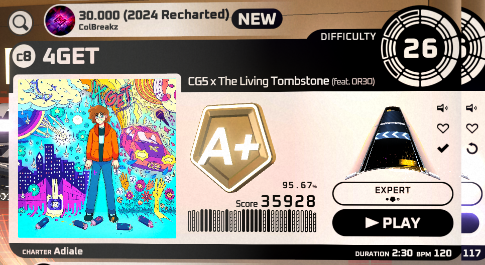

# SpinShareUpdater
**Adds an indicator button that shows if maps from SpinShare are up-to-date, as well as updates maps if an update is available.**

The indicator button is below the like/favorite/heart toggle button on the right side of map cards when selecting maps.
- If the icon is a checkmark, the selected map is up to date. Pressing it in this state will re-fetch data from SpinShare.
- If the icon is a rotating arrow, the selected map is out of date and can be updated. Pressing it in this state will update the map.
- If the icon is an X, an error occurred when fetching map data. Pressing it in this state will attempt to re-fetch data from SpinShare.

Status of map data is kept around for 30 minutes. After 30 minutes, the map data will be re-fetched if/when selecting the map again.

The mod will purposefully wait 1 second after map previews start before automatically fetching data from SpinShare to prevent unnecessary requests being sent to SpinShare. 

## Configuration
There's only 1 toggle setting in the added Mod Settings page: old map data can either be renamed with a filename indicating it's old, or it can outright be replaced with updated map data.

## Dependencies
- SpinCore
- SpinShareLib